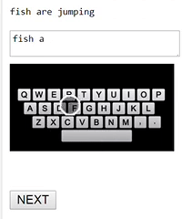
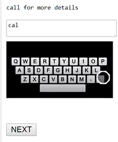
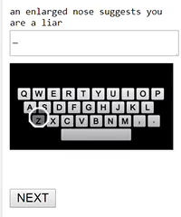

# Controlled Experiment Comparing Text Input Methods for Smartwatches
The final report can be read [here](https://github.com/antoineviscardi/ZoomKeyboardStudy/edit/master/HCI_hw2.pdf)

### The four studied conditions

|  | Normal keyboard                   | Zooming keyboard                |
| ----------------------- | --------------------------------- | ------------------------------- |
| **Without visual feedback** |  |  |
| **With visual feedback**    |   |   |

